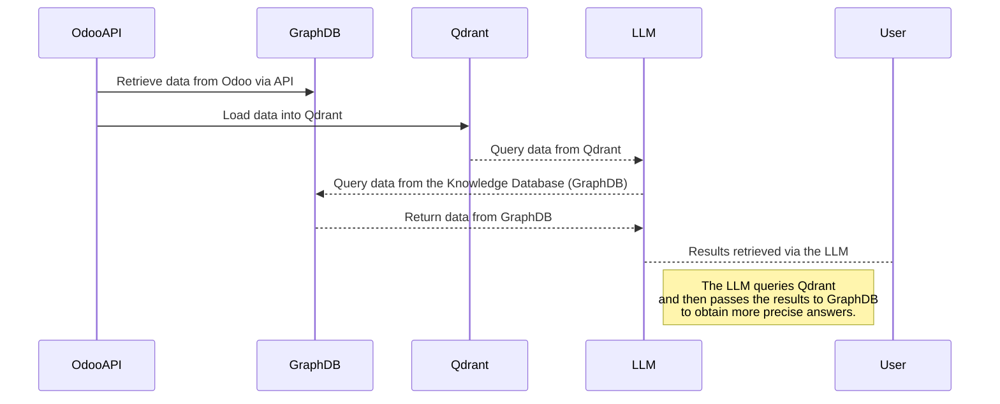

# 🚀 OdooVerse-Analytics

## 📌 Introduction  
This project integrates Odoo, Power BI, and a language model (LLM) to optimize enterprise data management and analysis. With this solution, data stored in Odoo can be visualized in Power BI, queried intuitively through the LLM, and analyzed using Machine Learning techniques in Python. The goal is to improve decision-making, facilitate access to information, and enhance predictive analytics in business environments.

### ✅ What Problem Does It Solve?  
This project simplifies the analysis and interpretation of data stored in Odoo by integrating it with Power BI and an LLM. It allows data to be:  
- **Visualized** in Power BI through interactive reports and intuitive dashboards.  
- **Queried** using the LLM, enabling managers and stakeholders to access information naturally without technical knowledge.  
- **Analyzed and predicted** with Machine Learning techniques in Python, enhancing data-driven decision-making.  

### 🎯 Why Is It Useful?  
This approach democratizes access to information in Odoo, allowing different company roles (managers, analysts, stakeholders) to:  
- Make more informed decisions thanks to visual reports and predictive analysis.  
- Access key data without relying on BI or SQL experts.  
- Improve operational efficiency by automating data queries and analysis.  

## 🏗️ Project Architecture  
This project consists of three main components:  

- 📊 **Power BI**: For data analysis and visualization.  
- 🏢 **Odoo**: ERP platform where business data is stored and managed.  
- 🤖 **LLM**: Language model that enables natural language queries on data.
- 📓 **Jupyter** : For advanced analysis and data modeling..

### 🔄 Data Flow  
This project integrates multiple tools to extract, analyze, and query Odoo data efficiently. The data flow follows these steps:  

1. **Data Extraction**: Odoo provides structured data, which is sent to Power BI for visualization, to Qdrant and GraphDB for processing in the LLM, and to **Jupyter** for in-depth analysis.  
2. **Analysis and Visualization**:  
   - **Power BI** transforms the data into interactive dashboards, facilitating visual analysis.  
   - **Jupyter** enables advanced statistical analysis, data exploration, and modeling.  
3. **Intelligent Queries**:  
   - **LLM** allows natural language questions about the data.  
   - **Qdrant** performs efficient searches in its vector database to retrieve relevant information.  
   - **GraphDB** acts as a Knowledge Graph, providing structured context and relationships between data.  


### 📷 **Integration Example:**  
#### 📌 **Data in Odoo**  

- **Odoo CRM:** CRM module view in Odoo, where customers, opportunities, and sales pipelines are managed.  
    

- **Products in Odoo:** List of products stored in Odoo, including details such as name, category, and price.  
    

- **Sales in Odoo:** Sales and order records managed in Odoo, providing an overview of business transactions.  
    

---

#### 📊 **Visualization in Power BI**  

- **CRM Dashboard in Power BI:** Visual analysis of customers, opportunities, and sales pipeline status based on Odoo data.  
    

- **Orders Dashboard in Power BI:** Visual report with metrics on completed orders, purchase trends, and sales performance.  
    

- **Sales Dashboard in Power BI:** Detailed sales analysis, including revenue volume, best-selling products, and market trends.  
    

- **Products Dashboard in Power BI:** Key information on products, inventory, and market performance.  
    

- **Advanced Product Analysis in Power BI:** Detailed view with specific metrics on stock, categories, and product trends.  
  

- **OdooVerse Analytics PBI Model**  
  

## 🔍 Detailed Analysis  
#### LLM
To ensure efficient analysis, the system uses **Qdrant** and **GraphDB** to store and structure information extracted from Odoo.  

- **Qdrant** handles vector storage, enabling fast and efficient similarity-based searches.  
- **GraphDB** organizes information into a semantic hierarchy, allowing structured and enriched queries.  

In this process, data from Odoo is extracted through its API and loaded into two databases: **Qdrant** and **GraphDB**. The LLM then queries **Qdrant** to retrieve relevant data. Subsequently, the retrieved results are sent to **GraphDB**, a **Knowledge Graph**, to obtain more complete and precise answers. This data flow enables advanced analysis by combining information from both databases to enrich responses.  

The following diagram details this process:  


Below are examples of how queries are handled in **Qdrant** and the data hierarchy in **GraphDB**:

*Example of a Qdrant query to retrieve information based on vector similarity.*  


*Representation of the data hierarchy in GraphDB, structuring information to enhance queries and analysis.*  


#### Jupyter Notebooks  

  

The recommendation system implemented in this project is well-structured and leverages **collaborative filtering** techniques to provide accurate product recommendations to users. It utilizes:  

- **K-Nearest Neighbors (KNN)**: Finds similar users or products based on interaction history, ensuring personalized recommendations.  
- **Singular Value Decomposition (SVD)**: Reduces dimensionality and extracts latent features, improving recommendation accuracy even with sparse data.  

This hybrid approach allows the system to adapt to different user behaviors, providing relevant suggestions based on past interactions. Jupyter notebooks are used for data preprocessing, model training, and evaluation, enabling an interactive and flexible workflow for refining recommendation strategies.
 
It is structured as follows:  
- [🔗 **Exploratory Data Analysis (EDA)**](https://github.com/LennyMGarcia/OdooVerse-Analytics/blob/main/OdooVerse-Analytics-ML/notebooks/01_EDA.ipynb) – Initial data exploration to understand distributions, correlations, and potential patterns.  
- [🔗 **Preprocessing**](https://github.com/LennyMGarcia/OdooVerse-Analytics/blob/main/OdooVerse-Analytics-ML/notebooks/02_preprocessing.ipynb) – Data cleaning, feature engineering, and transformation to prepare for modeling.  
- [🔗 **Model Construction**](https://github.com/LennyMGarcia/OdooVerse-Analytics/blob/main/OdooVerse-Analytics-ML/notebooks/03_basic_model.ipynb) – Implementation of collaborative filtering techniques like KNN and SVD.  
- [🔗 **Model Evaluation**](https://github.com/LennyMGarcia/OdooVerse-Analytics/blob/main/OdooVerse-Analytics-ML/notebooks/04_model_evaluation.ipynb) – Performance assessment using metrics like MAE to ensure recommendation accuracy.  
- [🔗 **Model Selection**](https://github.com/LennyMGarcia/OdooVerse-Analytics/blob/main/OdooVerse-Analytics-ML/notebooks/05_final_model.ipynb) – Choosing the best-performing model for deployment.  

## 🛠️ Prerequisites  
To run this project correctly, make sure you have the following tools installed:  
- 🔹 **Qdrant** – A vector search engine for embedding storage and retrieval. [🔗 Official site](https://qdrant.tech/)  
- 🔹 **Power BI** – A data analytics and visualization platform. [🔗 Download](https://powerbi.microsoft.com/)  
- 🔹 **GraphDB (Ontotext)** – A graph database for semantic storage. [🔗 Official site](https://www.ontotext.com/products/graphdb/)  
- 🔹 **Python** (Recommended version: `>=3.X`) – For data processing and machine learning. [🔗 Download](https://www.python.org/)  
- 🔹 **Odoo** (Recommended version: `16+`) – An ERP system for enterprise data management. [🔗 Official site](https://www.odoo.com/)
- 🔹 **Jupyter Notebook** – An interactive computing environment for data analysis and modeling. [🔗 Official site](https://jupyter.org/)    

## 🚀 Installation & Setup  
1. **Clone the repository**  
   ```bash
   git clone https://github.com/LennyMGarcia/OdooVerse-Analytics
   # Import data in Odoo
   cd your_project
   cp basic_info_getter C:\Program Files\Odoo 18.0.20250125\server\odoo\addons # or Linux alternative
   # Reset Odoo service with net.exe stop "servicename" && net.exe start "servicename" (Windows)
   sudo systemctl restart odoo16.service # Bash


> [!IMPORTANT]
> It is important to restart the service to load the new module. After it loads, go to the Apps tab in Odoo and install the new module.


